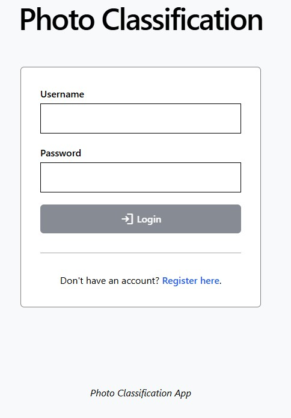
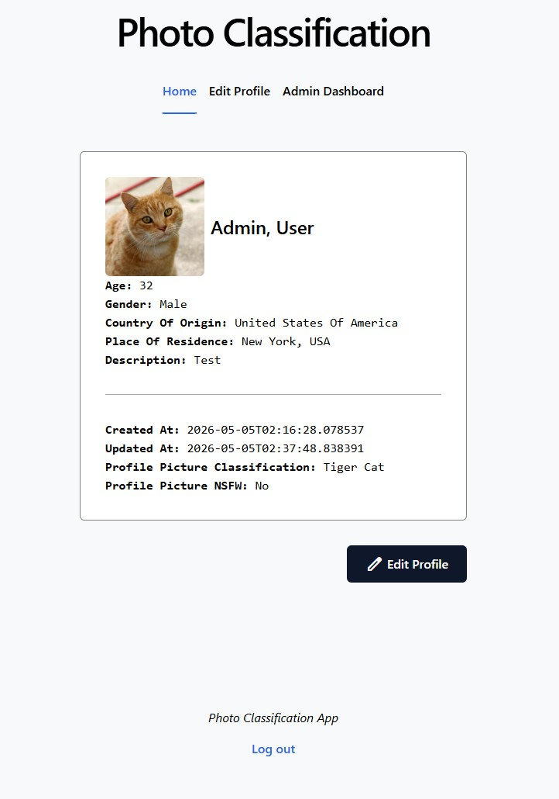
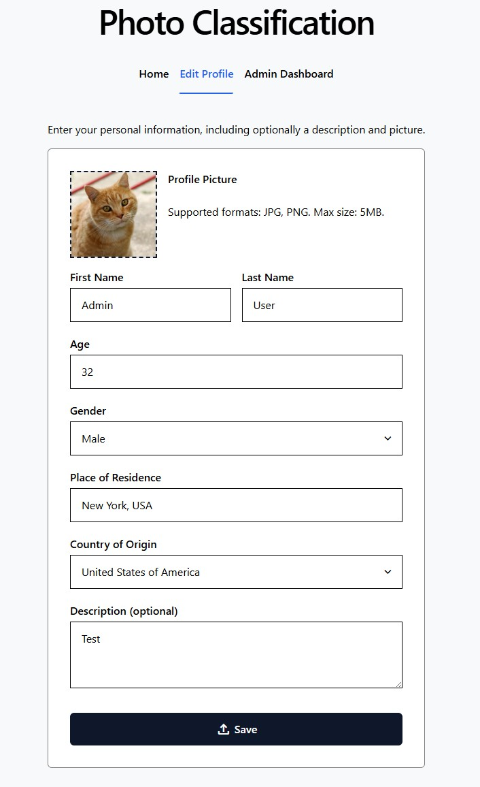
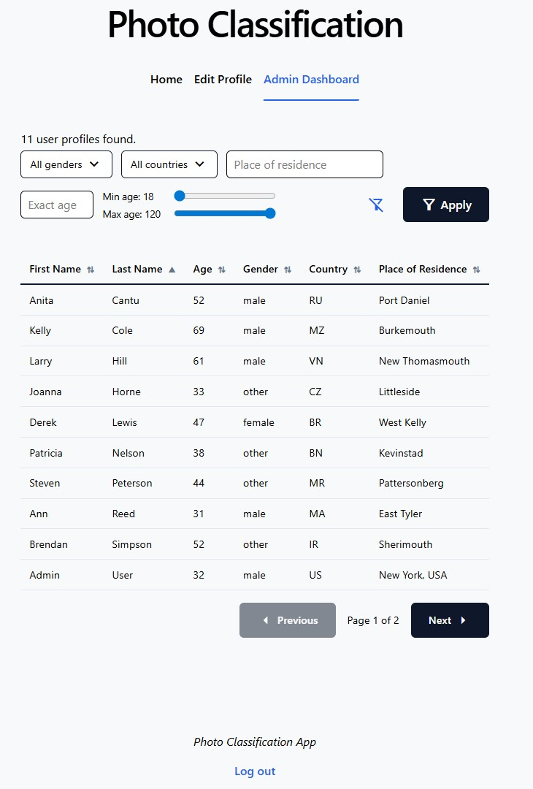
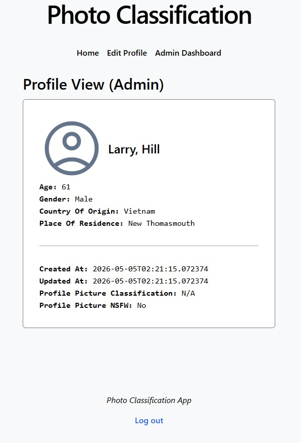

# Photo Classification - Frontend (Angular)

This is the frontend project associated with the FastAPI backend, with the latter hosted in a separate repository: https://github.com/aryobarzan/photo_classification-fastapi

## Development server

To start a local development server, run:

```bash
ng serve
```

Once the server is running, open your browser and navigate to `http://localhost:4200/`. The application will automatically reload whenever you modify any of the source files.

## Screenshots

Some demonstrative screenshots can be seen below. (the logged in user is an admin)

<details>
<summary>Login</summary>



</details>

<details>
<summary>Home page (profile view)</summary>



</details>

<details>
<summary>Profile editor</summary>



</details>

<details>
<summary>Admin dashboard</summary>



</details>

<details>
<summary>Admin profile view of another user</summary>



</details>
